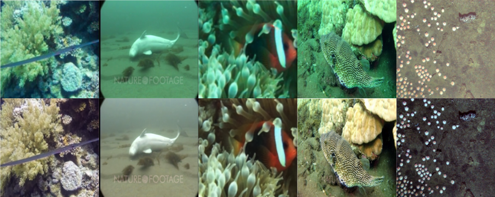

# Underwater Images Enhancement

Enhancing underwater images to restore natural color, improve visibility, and recover details often lost due to light absorption and scattering in underwater environments.

---

## Project Overview

Underwater images often suffer from:

* Color distortion (especially loss of red channel)
* Low contrast
* Noise and hazy appearance
* Detail degradation

This project provides a lightweight enhancement workflow to improve the visual quality of underwater images.

---

## Features

* Simple and effective underwater image enhancement
* Color correction and contrast improvement
* Batch processing support (folder-based)
* Example input image included

---

## 🖼 Example

### Input Image



> Enhanced results will be added soon.

---

## ⚙️ Installation

### 1️⃣ Clone the Repository

```bash
git clone https://github.com/pinwei123/Underwater-Images-Enhancement.git
cd Underwater-Images-Enhancement
```

### 2️⃣ Install Dependencies

(Modify based on your actual package usage)

```bash
pip install numpy opencv-python matplotlib
```

---

## ▶️ Usage

Example command (modify based on your script structure):

```bash
python unet/train.py
```
